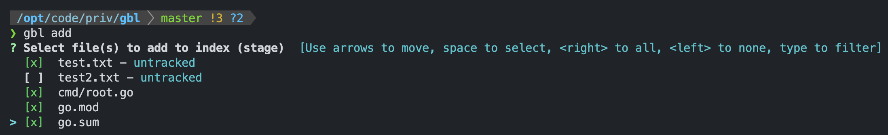
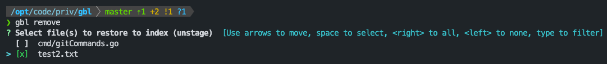

# gbl
A cli tool for switching between local git branches. 

# How to use
## Installation
Prerequisite: You need Go to use this tool. Go to https://golang.org/doc/install to install.

Run this in your terminal to install:
```
go install github.com/boksasp/gbl@latest
```

## Using gbl

### Switch branch
In a directory containing a git repository, run `gbl` in the terminal to get a list of all the branches you have locally, and press 'enter' to select the one you want to checkout.


### Delete branch(es)
You can delete multiple branches with `-d, --delete` (or force delete with `-D, --force-delete`).


### Stage file(s)
Add modified files to index with `gbl add`. Includes untracked files.



### Unstage file(s)
Remove files from staging area, leaving modifications intact, with `gbl remove`.



# Why
I found myself switching between branches a lot, and I enjoy using the terminal. So I wanted to make my life just a bit easier.  
I'm extending it with other git commands as I see the need.

This tool started as a bash script which used Whiptail for creating the select menu.

I wanted to learn Go, so I chose this tool to be my first project.  
It turned out to be (way) better for cross-platform use, so it's nice to be able to use this on Windows and not just Mac/Linux.
